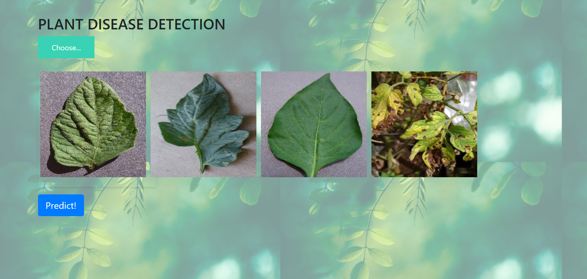
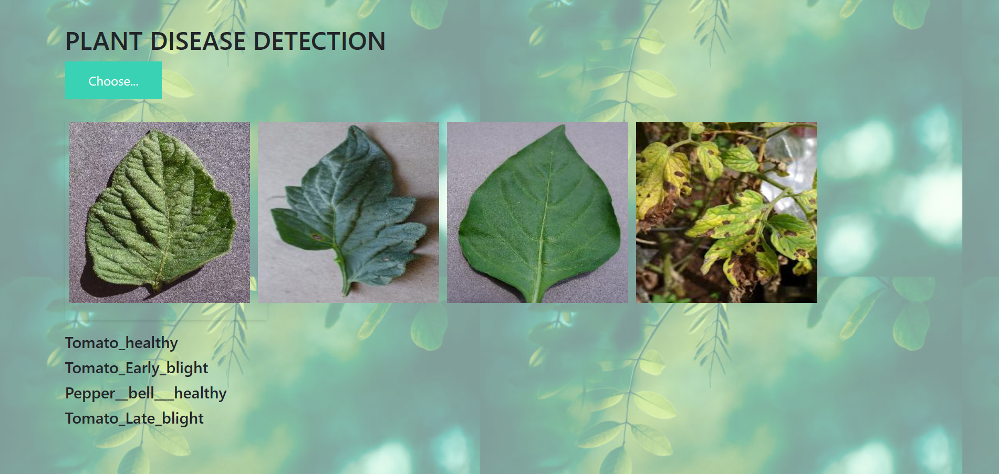

# 🌱 Plant Disease Detection - Flask Web App

This project is a **Flask-based Web Application** that allows users to **upload images of plant leaves** to detect possible diseases using a machine learning model.

---

## 🚀 Setup, Run & Access the Web UI

### Initial setup
`pip install -r requirements.txt`

### Run Python code and server
`python app.py`

### Access the UI
`http://127.0.0.1:5000/`

---

## 📷 Output Screenshots
### **1️⃣ Upload Plant Images **

### **2️⃣ Predicted Plant Disease **

